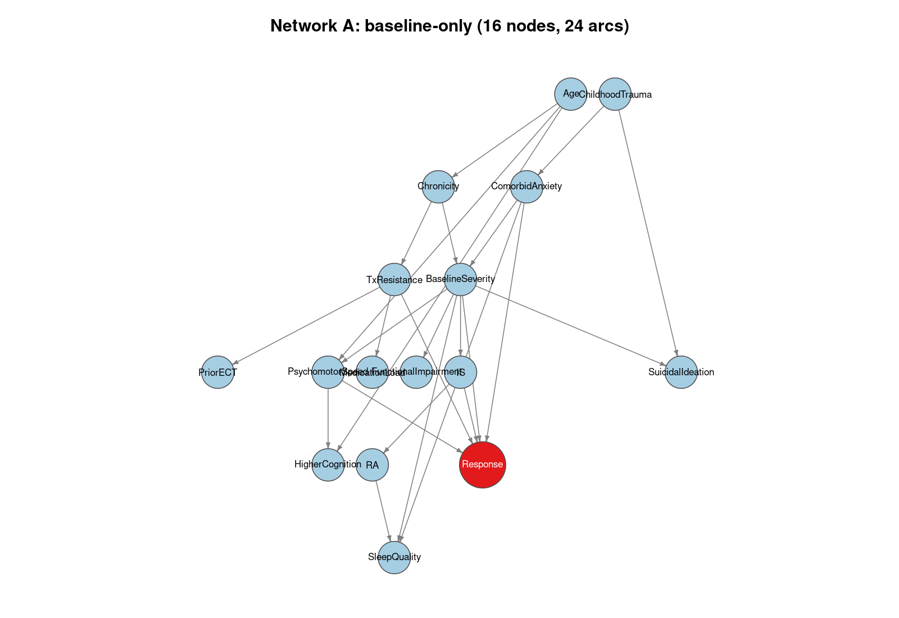
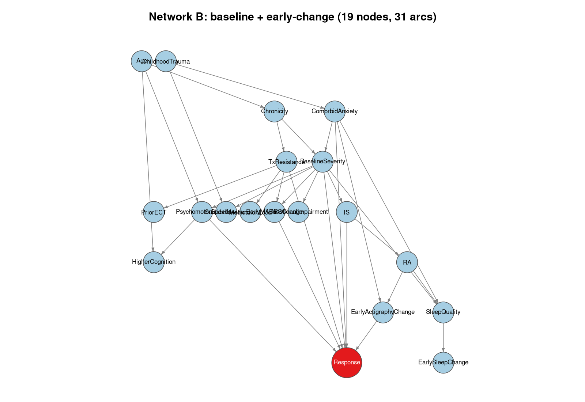
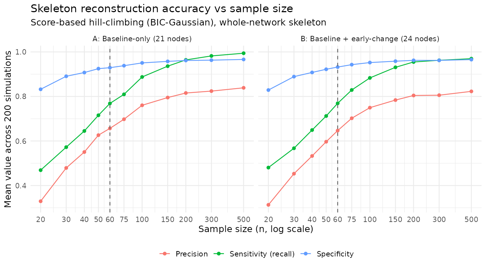
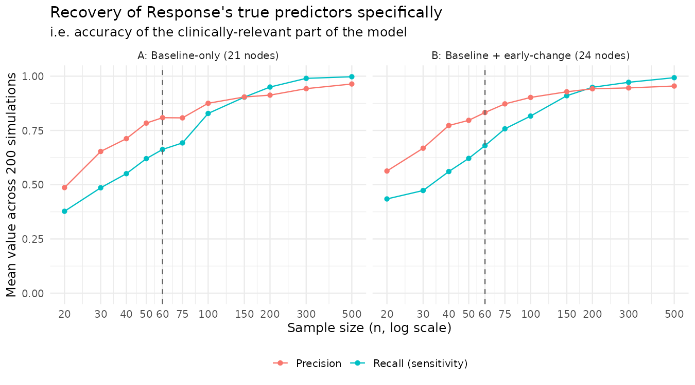
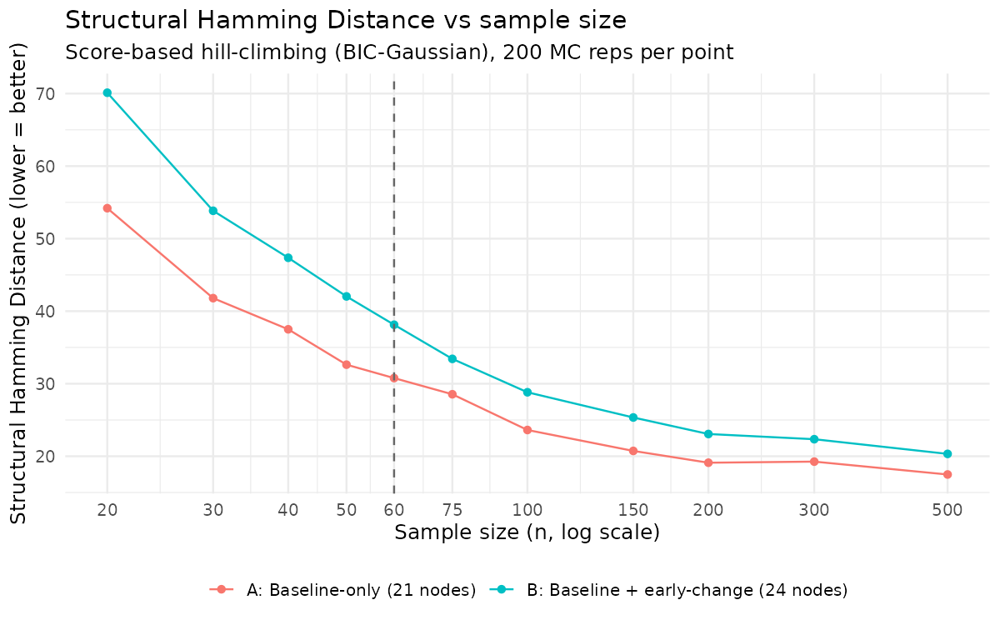
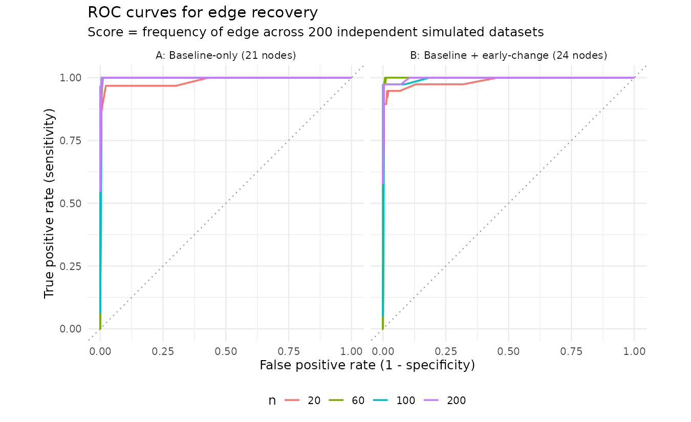
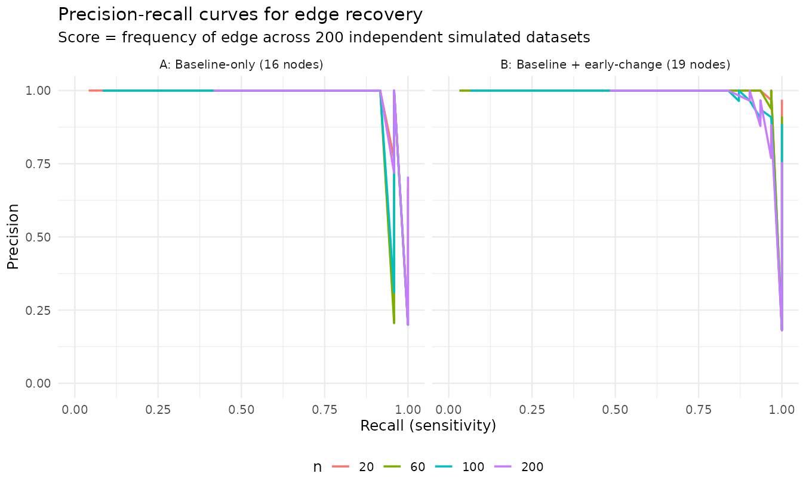

## Motivation

We want to build a **predictive model** for (e.g. Ketamine) treatment response using a Bayesian network. 
Our measurements include a handful of clinical variables, some neuropsychological test scores, a few actigraphy-derived circadian-rhythm metrics, and an outcome. We hypothetise 15 (20 in another version of these simulations) candidate causal predictors, and our planned sample size is $n = 60$, set mostly because of feasibility: recruitment window and budget, not because of a formal power analysis.

The present simulation scheme acts as en empirical evaluation to answer the following question: *How good is n = 60 to learn a useful network with 20 variables?*.

Traditional power analysis cannot be applied here, as there is no single effect size or test statistic to power for. The "result" is an entire graph structure and the quality of the prediction on an outcome. 

We first define a plausible ground-truth network. Then, we generate synthetic
data from it at different sample sizes. In a third step, we run an intended structure-learning algorithm on each simulated dataset. Last, we measure how well it recovers the truth.

This tutorial walks through these steps, using [`bnlearn`](https://www.bnlearn.com/), for two versions of the network (predictors measured at baseline only, vs. baseline + a few early within-treatment change variables), across sample sizes from 20 to 500.

**Everything below is illustrative.** The network structure and effect sizes
are a reasonable placeholder built from a real 20-variable candidate list, *not* fitted to real pilot data. 
The code is written so any user can drop in their own DAG and effect sizes and get their own performance numbers out. The network reconstruction algorithm module can also be replaced with a different methods. See the [Adapting this for your own project](#adapting-this-for-your-own-project) section at the end.

```{r}
#| label: setup
#| include: false
suppressPackageStartupMessages({
  library(bnlearn)
  library(igraph)
  library(ggplot2)
})
```

## Step 1 - Define two candidate "true" networks

We compare two scenarios:

- **Network A (16 nodes)**: contains 15 baseline predictors from demographics/illness course, to comorbidity/history, to treatment history, to suicidality/functioning, to neuropsychological domain scores, to actigraphy rest-activity-rhythm (RAR) parameters, plus a continuous `Response` outcome node.
- **Network B (19 nodes)** consists in Network A plus 3 early within-treatment "change" variables (`EarlyMADRSChange`, `EarlyActigraphyChange`, `EarlySleepChange`), testing whether adding longitudinal predictors helps or hurts structure recovery at a fixed sample size.

::: {.callout-note}
The original candidate list had 20 baseline predictors (available in a different tutorial, which uses `R/01_define_networks.R` instead of `R/01_define_networks(smaller).R`). Trimmed to 15 here by collapsing correlated items into composites rather than dropping them outright: 4 neuropsychological domain scores became 2 (`PsychomotorSpeed` kept standalone, as it has the most ketamine-specific evidence in the cited literature, while executive function, learning/memory, and attention/
working memory were merged into a single `HigherCognition` composite), and 3 actigraphy sleep metrics became 1 (`SleepQuality`). One weak predictor, `FamilyHistory`, was dropped outright rather than merged.
:::

```{r}
#| label: define-networks
#| file: R/01_define_networks(smaller).R
```

Both are directed acyclic graphs (DAGs) built with `bnlearn::model2network()`.
Here's what they look like. `Response`, the node we actually care about
predicting, is highlighted:

::: {layout-ncol=2}



:::

## Step 2 - Attach effect sizes

Each arc gets a linear-Gaussian standardised coefficient |β| ~ 0.30–0.55, which are moderate effect sizes comparable to the small–moderate correlations reported in the depression-prediction literature). This turns the DAG into a fully specified generative model we can simulate from.


```{r}
#| label: fit-parameters
#| file: R/02_fit_parameters.R
```

The printed $R^2$ values are a sanity check on the signal we're asking the
learning algorithm to recover: moderate-to-strong ($R^2 \, \approx \,$ 0.35 - 0.75) for the `Response` node, not unrealistically easy and not hopeless.

## Step 3 - Evaluation metrics

A learnt network is compared to the true DAG at the level of the **skeleton**
(undirected edges), not directed arcs, because many DAGs are Markov-equivalent
(share the same CPDAG), penalising a correctly-recovered-but-reversed edge as
a complete miss would understate real performance. We report:

- **Precision, sensitivity (recall), specificity, F1** on the skeleton
- **Structural Hamming Distance (SHD)**, via `bnlearn::shd()`
- **`Response`-specific precision/recall** — i.e. how well the model recovers
  *only* the true predictors of `Response`, arguably one of the numbers that matters the most for a deployable clinical prediction model

```{r}
#| label: metrics
#| file: R/03_metrics.R
```

## Step 4 - Monte Carlo simulation across sample sizes

For both networks, at n = 20, 30, 40, 50, 60, 75, 100, 150, 200, 300, 500, we
simulate 200 independent datasets, learn structure via score-based
hill-climbing (`hc(..., score = "bic-g")`), with 10 random restats, and evaluate against the truth.
We also record, at n = 20/60/100/200, how often each possible edge was
learned across the 200 Monte Carlo replicates. This gives us a natural continuous "score" per edge, we will used later for ROC/precision-recall curves.

```{r}
#| label: run-simulation
#| file: R/04_run_simulation.R
#| cache: true
```

::: {.callout-note}
This chunk actually runs (200 $\times$ 11 $\times$ 2 = 4,400 `hc()` fits, each with 10 random restarts). It takes about 10 $\times$ 2–3 min the first time and is cached after that (`cache: true`), so subsequent renders are instant unless the code changes.
:::

### Whole-network reconstruction accuracy vs n

```{r}
#| label: fig-plot1
#| echo: false

```

Both networks show the same performance shape: accuracy indicators climb steeply from $n = 20$ to roughly $n = 150$, then plateaus. 
Specificity is high throughout (most possible edges are, correctly, not learned as networks are "sparse"), while precision is the slowest metric to climb: false-positive edges are the main error mode at small n.

At $n=60$, we see acceptable levels of precision ($72\%$) and sensitivity/recall ($73\%$) with a high specificity ($93\%$).

::: {.callout-note}
Some performance metrics (precision, specificity) decrease slightly from n=200 to n=500. It happens because the greedy hill-climbing algorithm can get stuck in a local optimum around "hub" variables (e.g. `BaselineSeverity`, `Chronicity`,
`ComorbidAnxiety`) that have several downstream dependents: a spurious
direct edge between two of those can capture their real-but-indirect relationship almost as well as the true confounding path. This can become *more* attractive to the greedy search as n grows and that correlation sharpens statistically. Random restarts (`restart = 10`) partly resolved it, but not entirely $\to$ room for research!
:::

### Recovery of `Response`'s true predictors specifically

```{r}
#| label: fig-plot2
#| echo: false

```

This is an even more clinically relevant curve. We answer the question: "Did we correctly identify what predicts the response?"

We see a very good precision (0.81), but a recall (0.66) lower than the global recall at $n= 60$ for the 21-node network.

### Structural Hamming Distance vs n

```{r}
#| label: fig-plot3
#| echo: false

```

This is an "edge-editing" distance from the true network. A value of $5$ for example, means that five ($5$) edges need to be added, removed or reverted from the predicted network to obtain the true network. This value is to be compared to the number of edges in the true network and to that in the predicted network. Notice that `bnlearn::shd()` operates on the CPDAGs; some edges are directed (typically part of a v-structure or whose direction can be identified from the graph structure) and others are not.

### ROC and precision–recall curves for edge recovery

A single `hc()` fit only gives a present/absent decision per edge, not a
score — so to get a genuine ROC/PR curve we use the **frequency with which
each possible edge was learned across the 200 independent simulated
datasets** at a given n as the continuous score, then sweep a threshold over
it.

```{r}
#| label: fig-plot4-5
#| echo: false
#| layout-ncol: 2


```

::: {.callout-warning}
The high ROC Area Under the Curve (AUC) here (0.97-0.99) could make us overconfident. That is an artefact of class imbalance, not an error. These are sparse graphs (31-38 true arcs out of 210-276 possible pairs), so specificity is easy to achieve just by not proposing edges at random, which inflates AUC. 

**The precision–recall curve is the more honest picture**: precision drops off well before recall reaches $1$, which is the more clinically relevant "how many of the edges I claim are real, actually are" question. Yet, the PR curves look almost "too good" at $n=20$. A single `hc()` fit on our actual $n=60$ dataset will not have near-perfect precision. We would get close to that by running many independent replicates (like the $200$ we did) and keeping only consistently-recovered edges. We cannot do this with one real dataset of fixed size. So the plot of Figure 1 are probably the most honest performance view in this regard.
:::

## Results summary

```{r}
#| label: tbl-summary
#| echo: false
summ <- read.csv("data/table1_primary_summary.csv")
knitr::kable(
  summ[summ$n %in% c(20, 60, 100, 200, 500), ],
  digits = 3,
  caption = "Mean reconstruction metrics at selected sample sizes (single hc, 200 MC reps each)"
)
```

**At n = 60 (Network A, single hc):** whole-network skeleton precision ≈
0.73, sensitivity ≈ 0.72, specificity ≈ 0.93, mean SHD ≈ 22; recovery of
`Response`'s true predictors specifically: precision ≈ 0.82, recall ≈ 0.59.

## Adapting this for your own project

- Replace the DAGs in `R/01_define_networks(smaller).R` (or `R/01_define_networks.R`) with your own candidate variable set and (best-guess) causal structure.
- Adjust effect sizes in `R/02_fit_parameters.R` to match expected or
  pilot-data correlations if you have them.
- If your outcome is genuinely binary (e.g. an exact ≥50% symptom-reduction
  cutoff) rather than continuous, this would need a conditional Gaussian
  network (`score = "bic-cg"` in `hc()` calls) with mixed node types instead of the pure
  Gaussian network used here. $R^2$ metrics for the response would also need to be changed.
- If you want to use a different/more tailored network reconstruction method, everything happens in `R/04_run_simulation.R` where we use the `hc()` function.

## Session info

```{r}
#| label: session-info
#| echo: false
sessionInfo()
```
